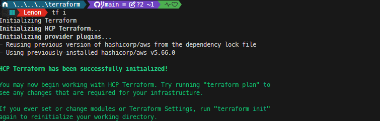

# **How I Deployed a Two-Tier Architecture in AWS Using Terraform**

AWS **Two-Tier Architecture** is a widely used deployment pattern for web applications in the cloud. It comprises two primary components or tiers:

## **1. Web Server Tier (Frontend)**  

Handles user requests and serves web pages. It includes: 

- **Load Balancers:** Distribute traffic across multiple servers for better performance and availability. AWS offers **Application Load Balancers** and **Network Load Balancers**.

- **Web Servers:** Deliver web content (HTML, CSS, JavaScript) and run dynamic applications (PHP, Python, Ruby, etc.).  

## **2. Database Tier (Backend)**  

Stores and manages application data. It includes:  
- **Database Server:** Hosts data, with AWS options like **RDS, DynamoDB,** and **Aurora**.

- **Storage:** Keeps the data using **EBS, S3,** or **EFS**.  

A **firewall (security group)** separates the two tiers, blocking direct internet access to the database for security. This design improves **scalability, security, and reliability**.  

---

## **Why Use Two-Tier Architecture?**  

- **Scalability:** Web and database layers scale independently—add more servers when needed.  
- **Fault Tolerance:** Multiple instances prevent failures from taking down the application.  
- **Security:** The database is isolated and only accessible by authorized sources.  
- **Performance:** Load balancers ensure smooth traffic distribution.  

This setup is **flexible, secure, and optimized for cloud deployments**.  

---

## **Two-Tier vs. Three-Tier Architecture**  

| Architecture  | Description |
|--------------|------------|
| **Two-Tier**  | Client (web) layer communicates **directly** with the database. |
| **Three-Tier** | Adds an **application layer** in between, improving security, scalability, and maintainability. |

Three-tier architecture is better for large applications but more complex and costly to set up.  

---

## **Deploying AWS Two-Tier Architecture with Terraform**  

We'll use **Terraform** (an **Infrastructure as Code** tool) to automate the setup:  

1. **Create a VPC** with public and private subnets.  
2. **Deploy an EC2 instance** (web server) in the public subnet.  
3. **Launch an RDS database** in the private subnet.  
4. **Configure security groups** to allow secure access.  

Terraform makes cloud deployments **fast, repeatable, and efficient** by defining resources in code.  

Let’s build a Two-Tier AWS setup with Terraform.  


# **AWS Two-Tier Architecture Components**

This two-tier architecture consists of the following components:

- **VPC:** A Virtual Private Cloud with CIDR `10.0.0.0/16`.  
- **Public Subnets:** Two subnets (`10.0.0.0/18` and `10.0.64.0/18`), each in a different Availability Zone for high availability.  
- **Private Subnets:** Two subnets (`10.0.128.0/18` and `10.0.192.0/18`), each in a different Availability Zone.  
- **Database Layer:** An **RDS MySQL instance** deployed in a private subnet.  
- **Application Layer:** An **Application Load Balancer (ALB)** to distribute traffic across public subnets.  
- **Compute Layer:** One **EC2 instance** in each public subnet to ensure high availability.  
- **Networking:** An **Internet Gateway** and **Elastic IPs** for public-facing EC2 instances.  

---

## **Prerequisites**  

Before deploying the infrastructure, ensure you have the following:  

- **Terraform CLI** installed  
- **AWS CLI** configured with credentials  
- An **AWS Account**  
- A **Code Editor** (e.g., Visual Studio Code)  
- **Terraform Registry Reference:** [Terraform AWS Modules](https://registry.terraform.io/)  
- **Terraform Cloud Account** for backend state management.

---

## **Next Steps**  

With these components in place, we will use **Terraform** to automate the deployment of this two-tier architecture in AWS. Let’s begin!  

**Create the following files within your repository to define and manage the AWS two-tier architecture:**

- `provider.tf` – Defines the AWS provider and required configurations.  
- `network.tf` – Sets up the VPC, subnets, and networking components.  
- `compute.tf` – Configures EC2 instances for the application layer.  
- `database.tf` – Provisions an RDS database for persistent storage.  
- `security.tf` – Defines security groups and access controls.  

>> The required terraform configuration for each file can be found in the `terraform` directory.


# **Deploying Your Infrastructure**

Before proceeding, ensure that your AWS credentials are correctly configured and that you're working from the root directory of your Terraform project.  

## **Step 1: Initialize Terraform**  

To set up your Terraform environment, run:

```bash
terraform init
```



 **What Happens When You Run `terraform init`?**  

- **Downloads Provider Plugins** – Ensures Terraform has the necessary AWS provider and any other dependencies.  
- **Sets Up the Backend** – Configures where Terraform will store its state, such as Terraform Cloud or an S3 bucket.  
- **Prepares the Workspace** – Initializes the directory, making it ready for Terraform operations.  

Once the initialization is complete, you can proceed with planning and deploying your infrastructure.  

## **Step 2: Preview the Execution Plan**  

Before applying changes, it's best to see what Terraform intends to do. Run:  

```bash
terraform plan
```


**What Happens When You Run `terraform plan`?**  

- **Validates the Configuration** – Scans your Terraform files for syntax errors and missing variables.  
- **Identifies Changes** – Compares the current state with the desired state and lists what Terraform will add, modify, or remove.  
- **Provides a Safe Preview** – Displays the expected changes without actually making any modifications to your infrastructure.  

Carefully review the output to confirm that the planned actions align with your expectations before applying the changes.  

## **Step 3: Apply the Configuration**  

Once you've reviewed the plan and confirmed the changes, apply the configuration with:  

```bash
terraform apply
```

**What Happens When You Run `terraform apply`?**  

- **Provisions Infrastructure** – Deploys new resources according to the Terraform configuration.  
- **Updates Existing Resources** – Adjusts any infrastructure that requires modifications to match the desired state.  
- **Executes the Approved Plan** – Ensures only the changes reviewed in `terraform plan` are applied.  

Terraform may ask for confirmation before proceeding. Type **`yes`** to finalize the deployment.  


 > `Terraform cloud` 


---

# Verify All Resources Are Created In The AWS Console

To ensure that all AWS resources are properly created, follow these verification steps:

## 1. Verify VPC and Subnets

- Go to **AWS Console → VPC Dashboard**
  - Confirm that the VPC (`lenon-2-tier-vpc`) exists.
  - Ensure both public and private subnets are created.
  

## 2. Check Subnet Association

- Go to **AWS Console → RDS → Subnet Groups**
  - Look for `lenon-2-tier-db-sub`.
  - Verify that it includes two private subnets: `lenon-2-tier-pvt-sub-1` & `lenon-2-tier-pvt-sub-2`.
  

## 3. Verify Route Table and Internet Gateway

- Go to **AWS Console → VPC → Route Tables**
  - Ensure public subnets are associated with a route table that includes a route to the Internet Gateway (`lenon-2-tier-igw`).
  - Private subnets should not have direct internet access.
  

## 4. Check Security Groups

- Go to **AWS Console → EC2 → Security Groups**
  - Verify that:
    - `lenon-2-tier-ec2-sg` allows inbound **HTTP (80)** and **SSH (22)** traffic.
    
    - `lenon-2-tier-db-sg` allows **MySQL (3306)** connections only from EC2 instances inside the VPC.
    

## 5. Confirm DB Parameter Group

- Go to **AWS Console → RDS → Parameter Groups**
  - If using `default.mysql5.7`, ensure it exists.
  
  - If using a custom parameter group, verify it is created and assigned to the RDS instance.

---

# 🎉 Congratulations on Completing the Lab! 🎉


Great job! You have successfully completed the lab and verified that all AWS resources were created correctly. This hands-on experience has strengthened your understanding of AWS infrastructure, networking, and security configurations.

By completing this lab, you have:

✅ Created and validated a multi-tier VPC setup.  
✅ Ensured proper subnet associations for RDS.  
✅ Verified route tables and internet gateway configurations.  
✅ Checked security group rules for EC2 and RDS.  
✅ Confirmed database parameter group settings.

This achievement brings you one step closer to mastering AWS resource management and Terraform automation. Keep up the great work, and continue experimenting with AWS to deepen your expertise!

---

## Proceed with Terraform Destroy

If all the verification steps above are confirmed and everything looks good, you can now run Terraform to delete all resources:

```bash
terraform destroy -auto-approve
```


